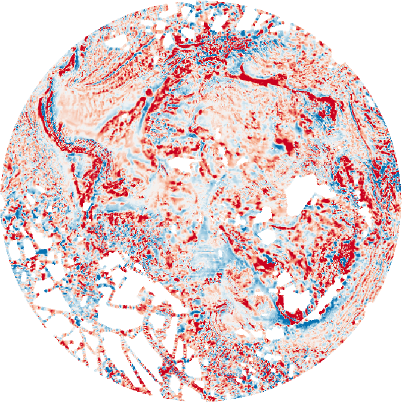

# ANTBGM
Transation towards Bedmap3(or BedMarchine:Antarctica), ANTGG2?, ADMAP3

The purpose of this dataset is filling data gap in current continental scale compliation using pubulic avaiable individual survey.

# Bedmap Antarcitca

Since the publication of Bedmap2(2013), Ice Penetrating Radar data has revealed the detail bedrock elevation information in the South Pole, Centre Marine Byrd Land, Recovery Lakes Glacier, Dornning Maud Land. These bed informations are estimated by satelite Free-Air gravity/topography transation in Bedmap2. Here, follow the workflow of building Bedmap2, new IPR data is merged with the exsit bed information.

Whether RTopo-2.0.4 data is better to reconstruct topography (with better bathymetry data) 
Schaffer, Janin; Timmermann, Ralph; Arndt, Jan Erik; Rosier, Sebastian H R; Anker, Paul G D; Callard, S Louise; Davis, Peter E D; Dorschel, Boris; Grob, Henrik; Hattermann, Tore; Hofstede, Coen M; Kanzow, Torsten; Kappelsberger, Maria; Lloyd, Jerry M; Ó'Cofaigh, Colm; Roberts, David H (2019): An update to Greenland and Antarctic ice sheet topography, cavity geometry, and global bathymetry (RTopo-2.0.4). PANGAEA, https://doi.org/10.1594/PANGAEA.905295, Supplement to: Schaffer, Janin; Kanzow, Torsten; von Appen, Wilken-Jon; von Albedyll, Luisa; Arndt, Jan Erik; Roberts, David H (in review): Bathymetry constrains ocean heat supply to Greenland's largest glacier tongue. Nature Geoscience

Work Flow:

1. Gather new radar information, make a mask with 50 Km away from new radar 
2. Mask original ice thickness data with 20 Km away from Radar Measurement in Bedmap2.
3. Regridding Ice thickness grid from Bedmap2 with new ice thickness data by Topo to Raster (ANUDEM algorithm: thin plate spline) in Arcpy.

With the publication of Bedmarchine Antarctica. The bed information is current the best avaliable dataset. The only datagap is in East Princess Elizabeth Land.

Bedmachine Antarctica data set have major improvement in outlet glacier where ice surface velocity > 50 m/a, mass conservation method is used to invert ice thickness.
For the slow moving area, they use streamline diffusion method to acount for asymetery (e.g. ice thickness varies slowly along slow in downstream; higher gradients when across flow).
.png)
**Mapping methods applied across the Antarctic continent (adapted from Figure S1 in Morlighem et al., 2019)**
GEA data in EDML is not incoperate in to Bedmachine Antarctica (Eagles, G., Karlsson, N. B., Ruppel, A., Steinhage, D., Jokat, W., & Läufer, A. (2018). Erosion at extended continental margins: Insights from new aerogeophysical data in eastern Dronning Maud Land. Gondwana Research, 63, 105-116.)

A new method (Reduced Uncertainty formulation) that combine pyhsical based model and data driven model to invert bed in large scale (~30 km) and middly sheared flow ( 5 ~ 50 m/a) area.

Monnier, J., & Zhu, J. (2019). Inference of the bottom topography in anisothermal mildly-sheared shallow ice flows. Computer Methods in Applied Mechanics and Engineering, 348, 954-977.

**Surface Ice Velocity (from CSA, JAXA and ESA data) [Rignot et al.])**

# AntGG11

**Free air gravity: ANTGG with new airborne survey + satellite model**

 

A interesting paper talk about the gravity data compilation in Antarctica.

Zingerle, P., Pail, R., Scheinert, M., et al. (2019). Evaluation of terrestrial and airborne gravity data over Antarctica – a generic approach. Journal of Geodetic Science, 9(1), pp. 29-40. Retrieved 4 Dec. 2019, from doi:10.1515/jogs-2019-0004

# ADMAP21

The large uncertainties in ADMAP2 are the data projection (Geosoft do not have EPSG:3031 projection) and the unclear data height in the final data compliation (subdata has different flight before stitching). 

Texure analysis of mag data has large effect due to the thick ice cover. Thick ice cover similar to sedimentary rock with no magnetization. Downward continuation of flight surface to bedsurface is tested to "remove" the effect of thick ice effect.

Recomplie ADMAP2 Dataset.
1. Project Individual Survery to EPSG:3031
2. Level filight line to a constant height
3. Grid TMI in different area. 
4. Stitching to get a continental scale compilation  

**TMI: ADMAP2 + new airborne survey**

 

